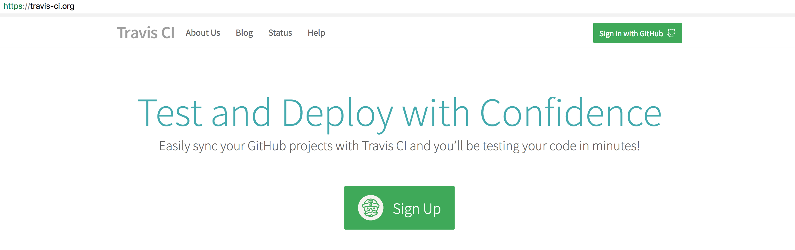
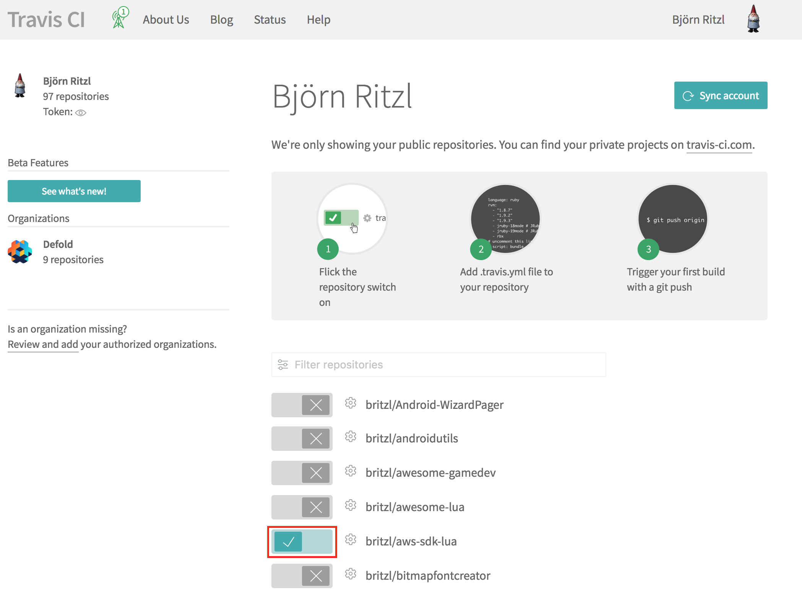
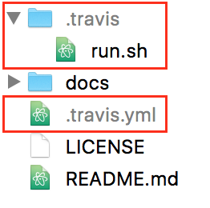

# Travis-CI for Defold
[Travis-CI](https://travis-ci.org) build script for the Defold game engine. Use these scripts to run unit tests whenever changes are made to your project or perform integration or performance checks on your project.

## Installation
Installation is a simple process. Sign up for a Travis-CI account and copy two files to your project and you're good to go!

### 1 - Signup
Sign up for an account at [Travis-CI](https://travis-ci.org).



### 2 - Enable
Enable Travis-CI for your GitHub hosted project from your profile page.



### 3 - Copy
Copy the ```.travis.yml``` file and ```.travis``` folder from this project to your own.



### 4 - Configure .travis.yml
Modify the ```.travis.yml``` file to suit your needs. If your project has library dependencies these need to be fetched, and depending on where the dependencies are hosted you may need to provide user authentication when fetching them.

#### 4.1 - Defold authentication
If any of the dependencies are hosted on Defold servers you need to provide your Defold user name and your access token. The access token can be generated from your user page on the [Defold dashboard](https://dashboard.defold.com).

For security reasons your auth token should not be put in clear-text in any build scripts. Travis-CI provides a way to encrypt sensitive data such as auth tokens. In order to use this you first need to [install the Travis-CI command line tool](https://docs.travis-ci.com/user/encryption-keys/). Once you have the travis command line tool setup do:

	travis encrypt DEFOLD_AUTH="access token from Defold dashboard"

Now open ```.travis.yml``` and replace:

	env:
	  global:
	    - DEFOLD_AUTH=foobar
	    - DEFOLD_USER=john.doe@gmail.com

With:

	env:
	  global:
	    - secure: <encrypted string from travis command line tool>
	    - DEFOLD_USER=<your username>

#### 4.2 Bootstrap collection
If your project is checked in to Git with a bootstrap collection other than the one you wish to use when running on Travis-CI you can add the path to the compiled boostrap collection as an environment variable named DEFOLD_BOOSTRAP_COLLECTION in ```.travis.yml```:

	env:
	  global:
		- DEFOLD_AUTH=foobar
		- DEFOLD_USER=john.doe@gmail.com
		- DEFOLD_BOOSTRAP_COLLECTION=/tests/test.collectionc

### 5 - Configure .travis/run.sh (optional)
If you want to customize the build process then make any necessary changes to ```.travis/run.sh```.

### 6 - Commit changes
Commit your changes to ```.travis.yml``` and Travis-CI will pick up on the changes and automatically start the build.
